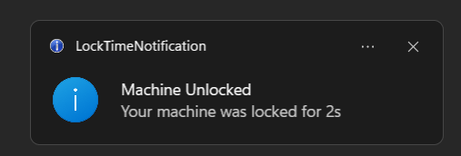

# LockTimeNotification
Sends a Desktop Notification when your computer is unlocked with the time between the lock and unlock event.

## Screenshot

## Usage
> Working on a GitHub Action to build the binary and create a release.

### Manual
You must have `dotenv (4.0.*)` installed.

1. Clone the repository.
2. Run `build.bat`
3. Copy contents of `app` folder to `C:\Program Files\LockTimeNotification`
4. Setup an Task to run the `LockTimeNotification.exe` on startup.